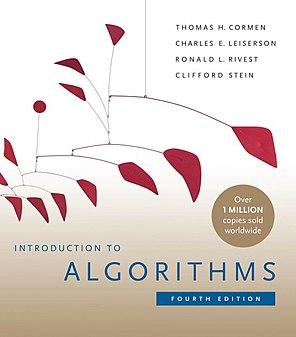

# clrs
My solutions to the exercises in "Introduction to Algorithms", third edition, by
Cormen, Lieserson, Rivest and Stein (also known as CLRS).

## Information

Exercises and potential necessary compilation information can be found on each
exercise's `README` file.
